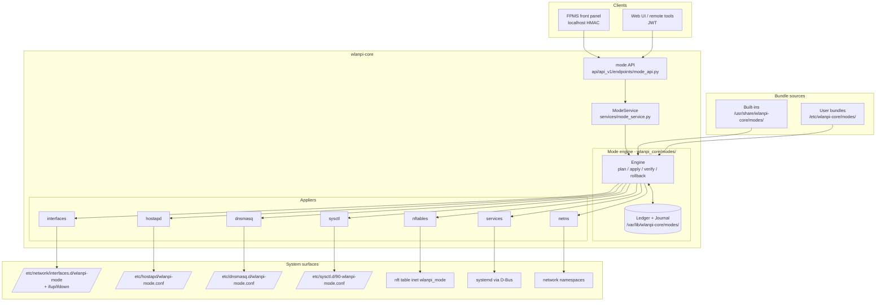
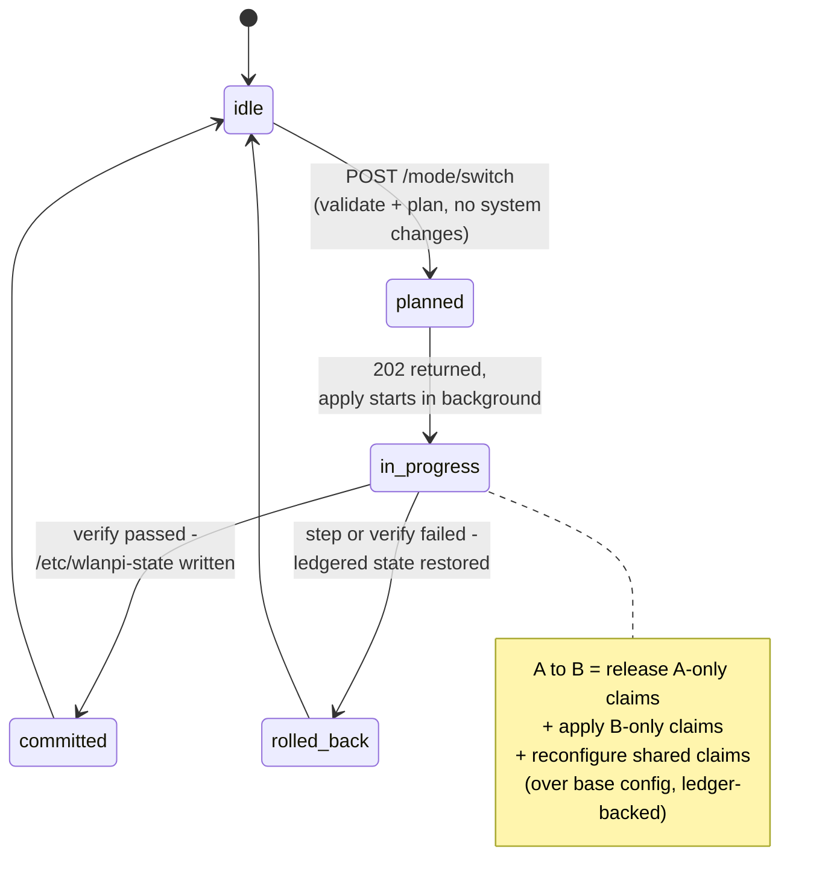

# Mode Manager Design

**Status:** Proposal (draft for discussion)
**Tracking issue:** [wlanpi-core#138](https://github.com/WLAN-Pi/wlanpi-core/issues/138)
**Related:** [wlanpi-fpms#152](https://github.com/WLAN-Pi/wlanpi-fpms/issues/152)

---

## 1. Overview

### The problem

WLAN Pi "modes" (classic, hotspot, server, wconsole) are implemented today as
per-package bash switcher scripts (`hotspot_switcher`, `server_switcher`,
`wconsole_switcher`) dispatched by wlanpi-common's `wlanpi-mode.sh`. Each switcher
backs up ~7 live config files, symlinks in templates from `/etc/wlanpi-<mode>/`,
enables services, writes `/etc/wlanpi-state`, and **reboots** - the reboot is the
only "apply" mechanism. The scripts are duplicated (no shared library), fragile
(they cross-edit each other's configs, off-paths are asymmetric), and this model
cannot be carried into bookworm/trixie.

### The general idea

Move mode management into **wlanpi-core** as a first-class feature:

- A **mode is a bundle**: a small, documented, declarative package (a manifest plus
  config file payloads) that describes network configuration, services, sysctl,
  firewall rules, and (optionally) network namespaces.
- A **mode engine** inside wlanpi-core applies bundles **live - no reboot** -
  through a plan → apply → verify → commit/rollback pipeline with a crash-safe
  journal.
- A mode is applied as an **overlay of claims** on top of the device's own base
  configuration. The engine records the pre-claim state of everything it touches
  in a **ledger**, so leaving a mode restores the device to *its current
  configuration* - including changes the user made via the API - never to a
  factory template. "Classic" is simply the empty overlay: no mode active.
- Transitions go **directly from mode A to mode B** (diff of claims); there is no
  forced pass through classic.
- Built-in modes (**classic, hotspot, server, bridge**) ship with wlanpi-core as
  bundles. Users author **custom modes** in the same documented format and
  **import/export them via the REST API**.
- The underlying stack is modernized: **dnsmasq** replaces isc-dhcp-server (EOL
  upstream since 2022), and a dedicated **nftables** table replaces the ufw
  `before.rules` NAT edits. **ifupdown is retained** (wlanpi-core already manages
  `/etc/network/interfaces.d/` content).

### Architecture at a glance



### Transition lifecycle

Every switch is a diff: release the claims only mode A holds, apply the claims
only mode B needs, reconfigure shared claims in place - all over the device's
base configuration, which the engine never owns.



### Legacy vs. new

| | Legacy (bullseye) | New (wlanpi-core mode engine) |
|---|---|---|
| Apply mechanism | **Reboot** | Live transition, no reboot |
| Config handling | Swap/symlink 7 stock files from templates | Engine-owned drop-ins + ledgered claims over base config |
| Leaving a mode | Restore `.suffix` backups (fragile) | Restore exact ledgered pre-claim state (incl. user API changes) |
| Transition path | Must pass through classic | Direct A→B (diff of claims) |
| DHCP server | isc-dhcp-server (EOL) | dnsmasq |
| NAT / firewall | ufw `before.rules` edits | Dedicated `wlanpi_mode` nftables table |
| Mode definitions | Hardcoded bash per package | Declarative bundles; user-authorable, import/export via API |
| Failure handling | None (reboot and hope) | Plan-first validation, verify checks, automatic rollback, crash-safe journal |
| Progress/observability | None | Journal-backed status API (poll `GET /mode/transition`) |

The rest of this document details the bundle format (§2), the engine (§3), the
API (§4), the built-in modes (§5), migration (§6), phasing (§7), and risks (§8).

---

## 2. Bundle format

### 2.1 Container

A bundle is a directory; it is exported/imported as a gzipped tarball named
`<name>.wlanpi-mode.tar.gz`:

```
hotspot/
├── manifest.yaml         # what the engine reasons about (required)
├── files/                # daemon config payloads, native syntax, templated
│   ├── hostapd.conf
│   ├── dnsmasq.conf
│   └── nftables.nft
└── README.md             # optional; surfaced in API metadata
```

The manifest is **YAML**: bundles are explicitly a hand-authored format, and YAML
supports comments and multi-line strings. It is parsed with `yaml.safe_load` and
validated into Pydantic models (`wlanpi_core/schemas/modes/bundle.py`); the API
itself continues to speak JSON. (PyYAML becomes a new dependency; Jinja2 is
already one.)

### 2.2 Hybrid model: the manifest carries semantics, the files carry syntax

Two pure approaches were considered and rejected:

- **Verbatim files only** (the legacy template model): the engine is blind - it
  cannot know which interfaces/services a mode touches, so it cannot order a live
  transition, diff mode A against mode B, build the claims ledger, or validate an
  import. This is exactly the legacy fragility.
- **Fully declarative** (generate hostapd/dnsmasq/nft configs from manifest
  fields): wlanpi-core would have to model the entire option space of three
  daemons and would forever lag them. The WLAN Pi audience is precisely the crowd
  that wants advanced hostapd knobs.

**The hybrid**: the manifest declares everything the *engine must reason about* -
interfaces claimed and their addressing, services to enable/start/stop, sysctl
keys, netns topology, template variables, verify checks, and the install target
of each payload file. Daemon configs ship as files in `files/` written in the
daemon's own native syntax (full power, zero schema lag), with light Jinja2
variable substitution. Payloads are validated by the daemons' own validators
(`nft -c -f`, `dnsmasq --test`, hostapd config parse) rather than by modeling
their syntax.

The accepted trade-off: mild duplication (an address may appear in both the
manifest and a payload) and the possibility of a payload inconsistent with its
manifest - caught by the native validators plus post-apply verify checks.

### 2.3 Manifest schema (illustrative - hotspot)

```yaml
schema_version: 1
name: hotspot
version: "2.0.0"
description: "Wi-Fi hotspot: wlan0 AP, NAT out of eth0"
author: "WLAN Pi Project"

default_persist: true          # server mode sets false → single-boot semantics

variables:
  ssid:
    generate: mac_suffix       # engine built-in generator
    args: { prefix: "WLANPi_", interface: eth0 }
    persist: true              # generated once, stored, reused on re-activation
  passphrase:
    generate: random_passphrase
    args: { length: 12 }
    persist: true

interfaces:                    # the engine CLAIMS these; everything else untouched
  - name: wlan0
    stanza: |
      iface wlan0 inet static
        address 172.16.43.1/24
  - name: eth0
    method: dhcp               # shorthand for trivial cases

sysctl:                        # rendered to /etc/sysctl.d/90-wlanpi-mode.conf
  net.ipv4.ip_forward: 1

files:                         # payload installs; dest checked against allowlist
  - src: files/hostapd.conf
    dest: /etc/hostapd/wlanpi-mode.conf
    template: true
  - src: files/dnsmasq.conf
    dest: /etc/dnsmasq.d/wlanpi-mode.conf
  - src: files/nftables.nft
    dest: /etc/nftables.d/wlanpi-mode.nft   # may only define table inet wlanpi_mode*

services:                      # names checked against the service allowlist
  - name: hostapd
    enable: true               # survive reboot while mode is active
    start: true
  - name: dnsmasq
    enable: true
    start: true

stop_services:                 # conflicts stopped while the mode is active
  - wpa_supplicant@wlan0       # prior enabled/active state is ledgered & restored

namespaces: []                 # §2.6; empty for all built-in modes

verify:                        # post-apply checks (engine-provided types only)
  - type: service_active
    services: [hostapd, dnsmasq]
  - type: interface_has_addr
    interface: wlan0
    address: 172.16.43.1

reconnect_hint:                # documented for API clients (§4.3)
  wlan0: 172.16.43.1
```

### 2.4 Variables and generators

Templating uses Jinja2 in a **SandboxedEnvironment** with only the `variables`
map and read-only system facts (hostname, per-interface MACs) in scope - no
filesystem access, no arbitrary Python.

"Generate on first activation" is expressed with `generate:` + `persist: true`.
Generators are **engine built-ins only** - `mac_suffix`, `random_passphrase`,
`random_hex`, `hostname` - so bundles never execute code. Resolved values are
stored in `/var/lib/wlanpi-core/modes/vars/<bundle>.json` and reused on
re-activation. This reproduces the legacy hotspot behavior (unique SSID from the
eth0 MAC, random passphrase generated once) declaratively.

### 2.5 Ephemeral modes (`persist`)

`default_persist: false` in the manifest, overridable per switch via the API
(`POST /mode/switch {"mode": "server", "persist": true}`), generalizes the legacy
server-mode single-boot behavior (`wlanpi-server-nonpersistence.service` +
`/etc/wlanpi-stay-in-server-mode` flag) into one mechanism owned by the engine:
services *are* enabled so a mid-session reboot boots into the mode once; the
wlanpi-core startup check then releases the mode's claims. No per-mode oneshot
units.

### 2.6 Network namespaces as a first-class primitive

Bundles may declare namespaces. The engine drives the existing
`wlanpi_core/namespaces/` package and `services/network_namespace_service.py`
primitives (create namespace, move phy via `iw phy set netns`, run allowlisted
services inside) rather than reimplementing them:

```yaml
namespaces:
  - name: sensor
    interfaces: [wlan1]
    addressing:
      - interface: wlan1
        method: dhcp
    services:
      - name: wlanpi-profiler   # same service allowlist as top-level services
```

None of the built-in modes use namespaces; the primitive exists for custom
bundles. On any mode switch the engine first calls
`network_namespace_service.revert_to_root()` so user netns configs never leak
across modes. The existing boot-time netns auto-activation in `app.py` stays
gated on classic and is unchanged.

### 2.7 Import security policy

Bundles install root-owned config and enable services, so import is privileged
and strictly validated (enforced in `wlanpi_core/modes/bundle.py`, exercised by
`POST /mode/bundles/validate`):

1. **No executable hooks.** The v1 format has no pre/post scripts; all behavior
   comes from declarative fields interpreted by the engine. (A future
   signed/trusted-bundle tier could revisit this; explicitly out of scope now.)
2. **Install-path allowlist** for `files[].dest` (prefix match, symlink-resolved,
   no `..`): `/etc/hostapd/`, `/etc/dnsmasq.d/`, `/etc/network/interfaces.d/`,
   `/etc/sysctl.d/`, `/etc/nftables.d/`, `/etc/ser2net.conf`. The engine - never
   the bundle - writes `/etc/wlanpi-state` and the interfaces include.
3. **Service allowlist**, extending the existing `allowed_services` mechanism in
   `services/system_service.py`: `hostapd`, `dnsmasq`, `ser2net`,
   `wpa_supplicant@*`, `lldpd`, iperf/tftpd, `wlanpi-*`. Unknown units are
   rejected at validation time, not at apply time.
4. **nftables containment**: payloads may only define tables named
   `wlanpi_mode*`, so revert is always a bounded `nft delete table`.
5. **Tarball hygiene**: reject absolute paths, `..` members, symlink/hardlink
   members; enforce a size cap.
6. **Namespace policy**: only interface moves and allowlisted services inside
   namespaces - no raw command execution.
7. Built-in bundle names (`classic`, `hotspot`, `server`, `bridge`) cannot be
   shadowed by imports.

---

## 3. The mode engine

### 3.1 Overlay/claims model - there is no "classic template"

The single most important design decision: **a mode is an overlay of *claims* on
top of the device's live base configuration.** The base configuration -
interfaces, VLANs, netns configs, anything the user set via the API or by hand -
is never owned or rewritten by the engine.

When a mode claims a resource, the engine records the *pre-claim state on this
specific box* in a **ledger** (`/var/lib/wlanpi-core/modes/ledger.json` plus a
backups directory):

| Claim | What is ledgered |
|---|---|
| File installed | The original file content (or the fact it was absent) |
| Interface claimed | Its prior stanza/addressing |
| Service enabled/started/stopped | Its prior enabled + active state (e.g. *was* `wpa_supplicant@wlan0` enabled on this box - not "classic says enable it") |
| sysctl drop-in | Implicit: removing the drop-in + `sysctl --system` restores base |
| nft table | Implicit: `nft delete table inet wlanpi_mode` |

Consequences:

- **"Classic" is the empty overlay** - no mode active - not a bundle of stock
  configs. Switching to classic releases all claims by restoring the exact
  ledgered pre-claim state, so the device returns to *its current base
  configuration, including every change the user made via the API before
  entering the mode*.
- User API changes to **unclaimed** resources made *while* a mode is active
  persist naturally - the engine never touches them.
- Crash rollback restores ledgered state, never a factory template.

**Claim conflict policy:** while a mode is active, API endpoints that would
mutate an engine-claimed resource (e.g. reconfiguring the AP interface while in
hotspot mode) return **409** - `core/mode_guard.py` grows a
`require_unclaimed(resource)` dependency backed by the ledger. Unclaimed
resources remain freely editable. The alternative ("allow and lose on mode
exit") was rejected: silent loss is worse than an explicit conflict.

### 3.2 Direct A→B transitions

There is no pass through classic, internal or otherwise. The engine diffs A's
ledgered claims against B's planned claims:

- Services only A needs → stopped and restored to ledgered state.
- Services both need → stay up; restarted only if their config changed.
- Interfaces claimed by both → reconfigured in place.
- A-only claims → released to base state; B-only claims → applied fresh
  (ledgering their pre-claim state, which is still *base* state - A never
  touched them).

Because the ledger always records base state (from before A), the sequence
A→B→classic still lands the device on its original configuration.

### 3.3 Engine-owned surfaces: drop-ins, never stock files

Unlike the legacy switchers, the engine never edits shared stock files
(`/etc/sysctl.conf`, `/etc/network/interfaces`, ufw rules). It owns dedicated
drop-ins:

| Surface | Engine-owned path | Applied via |
|---|---|---|
| Interfaces | `/etc/network/interfaces.d/wlanpi-mode` | `ifup`/`ifdown` (coexists with the existing `interfaces.d/vlans` writer) |
| hostapd | `/etc/hostapd/wlanpi-mode.conf` | systemd unit override (the user's `/etc/hostapd/hostapd.conf` is never replaced) |
| dnsmasq | `/etc/dnsmasq.d/wlanpi-mode.conf` | service restart |
| sysctl | `/etc/sysctl.d/90-wlanpi-mode.conf` | `sysctl --system` |
| Firewall/NAT | `/etc/nftables.d/wlanpi-mode.nft` (include added to `/etc/nftables.conf` once by postinst) | `nft -f`; revert = `nft delete table inet wlanpi_mode` |

Releasing claims = delete engine drop-ins, delete the nft table, `sysctl
--system`, restore ledgered originals.

### 3.4 Pipeline and apply order

`services/mode_service.py` is the API-facing facade; `wlanpi_core/modes/engine.py`
implements four phases:

1. **Plan** - load and validate the target bundle; resolve variables (running
   generators if unset); render templates to a staging directory; run native
   validators; diff against current claims; produce an ordered step list.
   **Zero system changes**; any failure aborts cleanly.
2. **Apply** - execute the steps below, journaling before/after each.
3. **Verify** - bundle `verify` checks plus engine invariants (claimed
   interfaces up, enabled services active within timeout).
4. **Commit or Rollback** - on success write `/etc/wlanpi-state` and mark the
   journal `committed`; on failure walk the journal backwards restoring
   ledgered state, mark `rolled_back`, and record the failing step for the
   status API.

Apply order for an A→B diff:

```
 1. Journal: state=in_progress, target, persist flag
 2. network_namespace_service.revert_to_root()
 3. Stop A-only services + B's stop_services (ledger prior state of new claims)
 4. ifdown interfaces being released or reconfigured
 5. Restore released claims from ledger; install B's files atomically
    (write .tmp in same dir, fsync, rename; ledger newly claimed originals)
 6. sysctl --system
 7. nft: delete old wlanpi_mode table, nft -f staged ruleset
 8. ifup B's interfaces (hard timeouts; reuse utils/network_management.py patterns)
 9. Create namespaces, move interfaces, start namespace services (if declared)
10. Enable + start B's services (hostapd before dnsmasq)
11. Verify phase
12. Write /etc/wlanpi-state; journal state=committed
```

Every step is idempotent ("ensure file absent", "ensure unit active"), so a
re-run or resumed transition is safe.

### 3.5 Crash safety and boot-time behavior

The journal (`/var/lib/wlanpi-core/modes/transition.json`, written atomically at
each step) records `{transition_id, target, previous, persist, state, current_step,
steps[], error}`. On wlanpi-core startup:

- Journal `in_progress` → the box died mid-switch: roll back by restoring
  ledgered state (lands on base config = classic), write `classic` to
  `/etc/wlanpi-state`, keep the failed record for the status API.
- Ephemeral marker present (`persist: false` mode committed before this boot) →
  release the mode's claims at boot, matching legacy server-mode single-boot
  semantics.

### 3.6 Checkpoints: point-in-time restore (P4)

The ledger restores exactly one level: base config + current mode overlay.
Deeper history ("get me back to how the box was configured yesterday, in
server mode, before I changed X") is delivered in P4 as **checkpoints** -
named point-in-time snapshots of the *managed config surface*: the same
files, interface configs, and service enable/active states the ledger
already knows how to capture and restore.

- `POST /api/v1/system/checkpoints` - create a named checkpoint;
  `GET .../checkpoints` - list; `POST .../checkpoints/{id}/restore` -
  restore; `DELETE .../checkpoints/{id}` - remove.
- The engine **auto-checkpoints before every mode switch**, so "back to how
  things were before I switched to hotspot" is always one restore away.
- Restore reuses the transition machinery unchanged: it is a plan → apply →
  verify → rollback run whose target is a snapshot instead of a bundle, with
  the same journal, crash safety, and 202-then-poll API behavior.
- Storage under `/var/lib/wlanpi-core/modes/checkpoints/`, with a bounded
  retention policy (count- and age-based pruning; auto-checkpoints pruned
  more aggressively than named ones).
- Scope and honesty about limits: a checkpoint captures the managed surface
  only - changes made entirely outside wlanpi-core's managed files/services
  (e.g. hand edits to unrelated system config over SSH) are not captured.

**Considered and rejected: per-change journaling** (append-only before/after
journal of every mutating API call, with rollback to an arbitrary change).
It offers finer granularity - surgically undoing one change while keeping
later ones - but requires every mutating endpoint in wlanpi-core to
participate in journaling forever, reopens the claimed-resource 409 policy
(§3.1) with a third "user override" layer, and introduces history-fork and
drift semantics. Checkpoints deliver most of the practical value ("go back
to a known-good point in time") on machinery the engine already has.

### 3.7 Prerequisite: systemd enable/disable over D-Bus

`services/system_service.py` exposes start/stop/restart via
`org.freedesktop.systemd1` but not enable/disable. Add
`enable_systemd_service()` / `disable_systemd_service()` using
`Manager.EnableUnitFiles` / `DisableUnitFiles` (+ `Reload`), guarded by the same
allowlist and reusing the existing D-Bus error/reconnect handling.

### 3.8 Compatibility surface

`/etc/wlanpi-state` remains the compatibility surface, written on commit. FPMS,
`system_service.get_mode()`, and `core/mode_guard.py` keep working unmodified;
the valid-mode list extends to dynamically include installed bundle names.

---

## 4. API surface

New router `api/api_v1/endpoints/mode_api.py`, registered in
`api/api_v1/api.py`, authenticated with the existing `verify_auth_wrapper`
(localhost HMAC / remote JWT / OTG) - consistent with today's reboot and
service-control endpoints. Errors use the existing `ValidationError(msg,
status_code)` convention.

| Method & path | Behavior |
|---|---|
| `GET /api/v1/mode` | Current mode, persist flag, last/active transition summary |
| `GET /api/v1/mode/list` | All modes (built-in + user bundles) with metadata, `builtin: bool` |
| `POST /api/v1/mode/switch` | Body `{mode, persist?}`. Validates + plans synchronously (fast, no system changes); returns **202 Accepted** `{transition_id}`; apply runs in the background |
| `GET /api/v1/mode/transition` (`/{id}`) | Journal-backed status: state, step *x/y*, human-readable step label, error detail |
| `GET /api/v1/mode/bundles/{name}` | Bundle manifest + metadata |
| `GET /api/v1/mode/bundles/{name}/export` | Tarball download (`application/gzip`); works for built-ins too - the documented starting point for customization |
| `POST /api/v1/mode/bundles` | Multipart tarball upload; full §2.7 validation; `?validate_only=true` for dry-run; 409 on collision with built-in names |
| `PUT /api/v1/mode/bundles/{name}` | Replace a user bundle |
| `DELETE /api/v1/mode/bundles/{name}` | Remove a user bundle (409 if currently active) |
| `POST /api/v1/mode/bundles/validate` | Validate an uploaded bundle without installing |

Status codes: 404 unknown bundle; 409 transition already running / claimed
resource / delete-active / name collision; 422 validation failure (structured
problem list); 503 subsystem failure.

### 4.1 The self-cutting-connection problem

A remote client switching modes will usually lose the very network path its
request rides on (eth0 re-addressed, wlan0 torn down). Addressed explicitly:

- Switch is **202 + background apply + polling**, never a blocking 200. The
  response is sent *before* any network-touching step runs (immediately after
  plan + journal write).
- Remote callers reconnect - possibly at a new address - and poll
  `GET /mode/transition`. Each bundle's `reconnect_hint` metadata documents the
  expected post-switch addresses so clients know where to reconnect.
- Polling, not the websocket streaming API, is the primary mechanism: a
  websocket dies with the network path exactly when status is needed; the
  journal-backed poll endpoint returns full state after reconnect. A streaming
  feed can be layered on later for localhost consumers.
- Localhost (HMAC) and OTG callers - FPMS, the front panel - are unaffected by
  the path cut and can poll continuously for progress display.

### 4.2 Concurrency and the single worker

wlanpi-core runs a single gunicorn worker; the transition must not block the
event loop. The apply phase runs in an executor thread
(`loop.run_in_executor`), since the appliers are sync `run_command`-style code.
An asyncio lock plus journal check rejects concurrent switches with 409.

---

## 5. Built-in modes

Built-in bundles ship read-only in `/usr/share/wlanpi-core/modes/<name>/` (via
`debian/wlanpi-core.install`); user bundles live in
`/etc/wlanpi-core/modes/<name>/`; engine state (ledger, journal, backups,
generated variables) in `/var/lib/wlanpi-core/modes/` - root-owned system state
belongs in `/var/lib`, unlike the per-user netcfg idiom. Built-in names always
win lookup.

### classic
Not a bundle - the **empty overlay** (no claims). Listed in `/mode/list` and
switchable like any mode: "switch to classic" releases all claims, restoring the
device's own base configuration, whatever the user has made it. Netns
auto-activation (existing behavior) remains allowed only here.

### hotspot
- eth0: DHCP client (upstream); wlan0: static `172.16.43.1/24`
- hostapd on wlan0 - SSID/passphrase from persisted `mac_suffix` /
  `random_passphrase` generators (preserves legacy personalization)
- dnsmasq: `dhcp-range=172.16.43.50,172.16.43.150`, bound to wlan0
  (`bind-interfaces` / `except-interface=eth0`)
- sysctl `net.ipv4.ip_forward=1`; nft `table inet wlanpi_mode` with postrouting
  masquerade out eth0 + forward-accept rules
- `stop_services: [wpa_supplicant@wlan0]`

### server
- eth0: static `172.16.42.1/24`; wlan0: static `172.16.43.1/24`
- dnsmasq serving both subnets; hostapd on wlan0
- ser2net if installed (tolerate-missing flag; package Suggests)
- TCP-tuning sysctl keys carried over from the legacy sysctl.conf as a drop-in
- **`default_persist: false`** - single-boot by default, exactly like legacy;
  `POST /mode/switch {"mode":"server","persist":true}` replaces the
  `/etc/wlanpi-stay-in-server-mode` flag

### bridge (re-specified)
The legacy bridge package never made it into bookworm/trixie images; it is
re-specified with modern tooling:

- Kernel bridge `br0` with `bridge_ports eth0` (ifupdown bridge stanza;
  `bridge-utils` dependency); `br0` runs as DHCP client for management
- wlan0 joins as an **AP** via hostapd `bridge=br0` - the clean, fully supported
  path; AP-side bridging needs no 4addr hacks
- Result: wired and Wi-Fi AP clients on one flat L2 segment; the Pi manageable
  on br0; no NAT, no DHCP server
- STA-side bridging (4addr/WDS) is explicitly out of scope for v1

---

## 6. Migration and compatibility

- **Packaging** (`debian/control`): add `Depends: hostapd, dnsmasq,
  bridge-utils, python3-yaml`; add `Conflicts:`/`Replaces:` on `wlanpi-hotspot,
  wlanpi-server, wlanpi-wconsole, wlanpi-bridge` so the legacy switcher packages
  are removed on upgrade and cannot fight the engine over `/etc`.
  isc-dhcp-server drops out with them. ufw stays installed (other features use
  it) but the engine never touches ufw config; NAT lives solely in the
  `wlanpi_mode` nft table.
- **Upgrade shim**: postinst / first start checks `/etc/wlanpi-state`; if the box
  is in a *legacy-applied* non-classic mode, restore the legacy `.suffix`
  backups the switchers left beside each swapped file (deterministic, documented
  paths), write `classic`, and log a "re-apply your mode via the API" notice.
  Best effort: if backups are missing, leave files in place and report - the
  engine never fabricates a "stock" config. This is the only legacy-aware code;
  the engine itself needs no legacy knowledge.
- **FPMS**: unchanged on day one - it reads `/etc/wlanpi-state`, which the engine
  keeps writing. Follow-up (separate repo): FPMS switches modes via
  `POST /mode/switch` over localhost HMAC and polls transition status for its
  progress screen, deleting its own switcher-invocation code.
- **CLI deprecation**: `wlanpi-mode.sh` becomes a thin wrapper calling the
  localhost API with a deprecation warning; removed after one release cycle.
  The dead `*_SWITCHER_FILE` constants in `wlanpi_core/constants.py` are
  retired.

---

## 7. Phasing

| Phase | Scope | Exit criteria |
|---|---|---|
| **P1 - Engine + built-ins + switch API** | `wlanpi_core/modes/` package (bundle loader, ledger, journal, engine, appliers for interfaces/hostapd/dnsmasq/sysctl/nftables/services/files), systemd enable/disable D-Bus additions, `mode_service.py`, `mode_api.py` (`GET /mode`, `/mode/list`, `POST /mode/switch`, `GET /mode/transition`), variables/generators (hotspot needs them), four built-in bundles, boot-time journal recovery + ephemeral release, packaging changes + legacy-restore shim | Live round-trips classic↔hotspot↔server↔bridge; rollback on induced failure; reboot persistence and `persist:false` semantics verified |
| **P2 - Custom bundles + import/export** | Tarball pack/unpack, full §2.7 validation policy, bundle CRUD/export/import/validate endpoints, bundle-format authoring documentation (the "well-documented format" deliverable), FPMS integration follow-up | A user-authored bundle exported, edited, re-imported, and activated via API only |
| **P3 - Namespace primitives** | `namespaces:` manifest section, netns applier bridging to `network_namespace_service` (incl. services-in-namespace), interaction rules with netcfg auto-activation, example namespaced custom bundle + docs | Example bundle activates with an isolated interface + service; clean release on mode exit |
| **P4 - Checkpoints** (§3.6) | Snapshot/restore of the managed config surface reusing the ledger + transition machinery; checkpoint CRUD/restore API; auto-checkpoint before every mode switch; retention/pruning policy | Create checkpoint → switch modes → change config → restore checkpoint returns the box to the captured state (mode included); auto-checkpoints prunable and restorable |

---

## 8. Risks and mitigations

1. **Cutting the client's own network path mid-transition** - 202-before-apply
   ordering, journal-backed polling, per-bundle `reconnect_hint`; residual risk
   documented for API consumers.
2. **Single gunicorn worker blocked by a multi-second transition** - apply runs
   in an executor thread behind a concurrency lock; ifup/service-start steps get
   hard timeouts (reuse the `restart_dhcp_with_timeout` pattern in
   `utils/network_management.py`) so a hung dhclient cannot wedge the engine.
3. **hostapd/dnsmasq interactions with existing code** -
   `hotspot_service._resolve_hostapd_conf()` must learn the engine's conf path
   (small P1 change); `wpa_supplicant@wlan0` must be stopped before hostapd
   claims wlan0 and is restored from the ledger on exit.
4. **nftables/ufw coexistence** - engine rules live in a dedicated table, but
   hook-priority interactions with ufw's chains need explicit testing (NAT and
   forwarding must work with ufw enabled).
5. **Power loss / journal edge cases** - atomic journal writes + idempotent
   steps + rollback-on-boot; worst case is boot-to-base-config (classic), never
   a bricked network.
6. **dnsmasq port 53** - `bind-interfaces`/`except-interface` required so DNS
   binding does not collide with local resolvers; enforced in shipped configs
   and checked by `dnsmasq --test`.
7. **Legacy-restore shim is best-effort** - missing `.suffix` backups are
   reported, not guessed at.

---

## Appendix A - Proposed code layout

```
wlanpi_core/modes/                      # engine internals (new package)
    bundle.py          # bundle load/validate/pack (tar)
    ledger.py          # claims ledger + backups
    journal.py         # transition journal
    engine.py          # plan/apply/verify/rollback state machine
    appliers/
        interfaces.py  # ifupdown drop-in + ifup/ifdown
        hostapd.py
        dnsmasq.py
        sysctl.py
        nftables.py
        services.py    # systemd enable/disable/start/stop via system_service
        netns.py       # wraps network_namespace_service
        files.py       # generic install/remove with ledger backup
wlanpi_core/services/mode_service.py    # API-facing facade
wlanpi_core/api/api_v1/endpoints/mode_api.py
wlanpi_core/schemas/modes/              # bundle.py, transition.py

/usr/share/wlanpi-core/modes/           # built-in bundles (read-only, shipped)
/etc/wlanpi-core/modes/                 # user/imported bundles
/var/lib/wlanpi-core/modes/             # ledger.json, transition.json, backups/, vars/
```

## Appendix B - Worked example: the hotspot bundle, end to end

The complete built-in hotspot bundle as shipped in
`/usr/share/wlanpi-core/modes/hotspot/`. Four files total.

### `manifest.yaml`

See §2.3 - that example *is* the hotspot manifest.

### `files/hostapd.conf` (`template: true`)

```ini
# WLAN Pi hotspot mode - installed to /etc/hostapd/wlanpi-mode.conf
# {{ ssid }} and {{ passphrase }} are resolved by the engine (generated once,
# then persisted in /var/lib/wlanpi-core/modes/vars/hotspot.json)
interface=wlan0
driver=nl80211

ssid={{ ssid }}
wpa=2
wpa_key_mgmt=WPA-PSK
rsn_pairwise=CCMP
wpa_passphrase={{ passphrase }}

hw_mode=g
channel=6
ieee80211n=1
ieee80211d=1
wmm_enabled=1
# country_code intentionally omitted - regulatory domain is managed
# device-wide by wlanpi-reg-domain, not per mode
```

A user customizing this bundle (export → edit → import) can add any hostapd
option here - `hw_mode=a`, 802.11ax settings, a RADIUS block - without
wlanpi-core needing to understand it. Only the install destination is
constrained.

### `files/dnsmasq.conf`

```ini
# WLAN Pi hotspot mode - installed to /etc/dnsmasq.d/wlanpi-mode.conf
# bind only where we serve; never fight a local resolver on eth0
bind-interfaces
interface=wlan0
except-interface=eth0

dhcp-range=172.16.43.50,172.16.43.150,255.255.255.0,12h
dhcp-option=option:router,172.16.43.1
dhcp-option=option:dns-server,172.16.43.1
```

### `files/nftables.nft`

```
# WLAN Pi hotspot mode - installed to /etc/nftables.d/wlanpi-mode.nft
# Import validation enforces that ONLY table inet wlanpi_mode* is defined,
# so releasing the mode is always: nft delete table inet wlanpi_mode
table inet wlanpi_mode {
    chain postrouting {
        type nat hook postrouting priority srcnat; policy accept;
        oifname "eth0" masquerade
    }
    chain forward {
        type filter hook forward priority filter; policy accept;
        iifname "wlan0" oifname "eth0" accept
        iifname "eth0" oifname "wlan0" ct state established,related accept
    }
}
```

### What the engine does with it

`POST /api/v1/mode/switch {"mode": "hotspot"}` from classic:

**Plan** (no system changes): resolve `ssid`/`passphrase` - first activation
runs the `mac_suffix` and `random_passphrase` generators and persists the
values (e.g. `ssid: WLANPi_9a2f3c`); later activations reuse them. Render
`hostapd.conf` in the Jinja2 sandbox; validate payloads (`nft -c -f`,
`dnsmasq --test`); compute claims: interfaces `wlan0`, `eth0`; services
`hostapd`, `dnsmasq` (enable+start), `wpa_supplicant@wlan0` (stop); three
files; one sysctl key; the nft table.

**Ledger** (written as claims are taken): `wlan0` had no static stanza →
"absent"; `eth0` was DHCP → recorded; `wpa_supplicant@wlan0` was
enabled+active → recorded; `hostapd`/`dnsmasq` were disabled+inactive →
recorded; each installed file → "did not exist".

**Apply**: 202 returned first → stop `wpa_supplicant@wlan0` → `ifdown` wlan0 →
install the three files + `interfaces.d/wlanpi-mode` + sysctl drop-in →
`sysctl --system` → `nft -f` → `ifup wlan0` (eth0 already DHCP, untouched in
practice - a claim over an identical config is a no-op) → enable+start
hostapd, then dnsmasq → **verify**: both services active, wlan0 has
172.16.43.1 → write `hotspot` to `/etc/wlanpi-state`, commit journal.

**Switch back to classic**: every claim is released to its *ledgered* state -
`wpa_supplicant@wlan0` re-enabled and started *because it was before*, not
because a template says so; drop-ins deleted; `nft delete table inet
wlanpi_mode`; wlan0 restored to its pre-mode config. If the user had, say, a
static eth0 config set via the API before entering hotspot mode, that is
exactly what comes back.

**Direct hotspot → server**: diff, not teardown - `hostapd` and `dnsmasq` stay
up (restarted once with server's configs), `wlan0` keeps 172.16.43.1/24
(identical claim, no-op), `eth0` is reconfigured DHCP → static 172.16.42.1/24,
the nft table is replaced, `ser2net` starts. The eth0 ledger entry still
records its original pre-hotspot state, so a later switch to classic restores
the true base config.

## Appendix C - Key existing code reused

| Existing code | Role in mode engine |
|---|---|
| `services/system_service.py` - systemd D-Bus layer, `allowed_services`, `get_mode()` | Service lifecycle (extended with enable/disable), mode read, allowlist |
| `core/mode_guard.py` - `require_mode()` | Extended with `require_unclaimed()` claim conflicts |
| `utils/general.py` - `run_command` / `run_command_async` | All shell-outs (`ifup`, `nft`, `sysctl`, validators) |
| `services/network_namespace_service.py` + `wlanpi_core/namespaces/` | Netns primitive (`revert_to_root`, phy moves, processes) |
| `utils/network_management.py` - DHCP/route helpers with timeouts | Timeout patterns for ifup/dhclient steps |
| `models/network/vlan/` - `interfaces.d/vlans` writer | Coexistence precedent for the `interfaces.d/wlanpi-mode` drop-in |
| `core/auth.py` - `verify_auth_wrapper` | Auth for all mode endpoints |
| `models/validation_error.py` | Error convention (404/409/422/503) |
